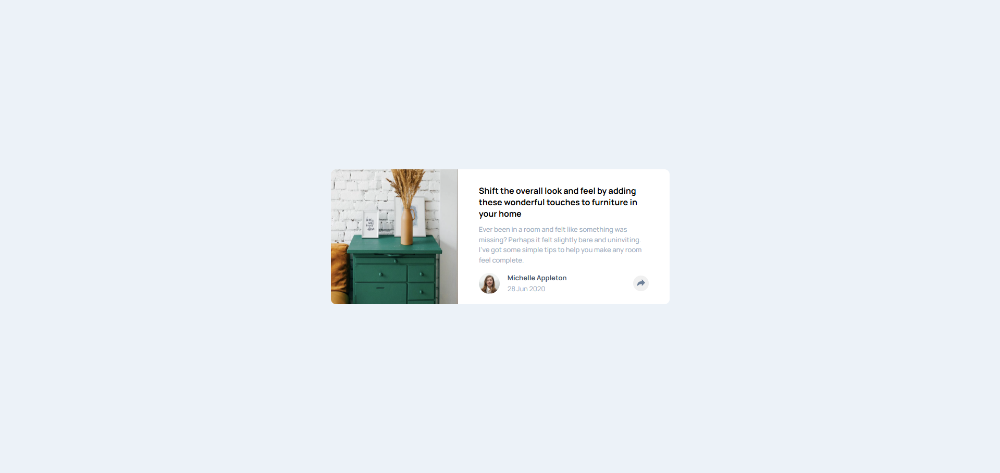

# Frontend Mentor - Article preview component solution

This is a solution to the [Article preview component challenge on Frontend Mentor](https://www.frontendmentor.io/challenges/article-preview-component-dYBN_pYFT). Frontend Mentor challenges help you improve your coding skills by building realistic projects.

## Table of contents

- [Frontend Mentor - Article preview component solution](#frontend-mentor---article-preview-component-solution)
  - [Table of contents](#table-of-contents)
  - [Overview](#overview)
    - [The challenge](#the-challenge)
    - [Screenshot](#screenshot)
    - [Links](#links)
  - [My process](#my-process)
    - [Built with](#built-with)
    - [What I learned](#what-i-learned)
    - [Continued development](#continued-development)
    - [Useful resources](#useful-resources)
    - [AI Collaboration](#ai-collaboration)
  - [Author](#author)

**Note: Delete this note and update the table of contents based on what sections you keep.**

## Overview

### The challenge

Users should be able to:

- View the optimal layout for the component depending on their device's screen size
- See the social media share links when they click the share icon

### Screenshot



### Links

- Solution URL: [Github](https://github.com/Odiesta/article-preview-component)
- Live Site URL: [Netlify](https://majestic-snickerdoodle-496ce6.netlify.app/)

## My process

### Built with

- Semantic HTML5 markup
- CSS custom properties
- Flexbox
- SCSS
- JavaScript
- Mobile-first workflow

### What I learned

In this project, I learned how to use **SCSS** to write more organized and maintainable styles with variables and nesting. I also practiced the **BEM** naming convention to keep my CSS classes clear and consistent.

I learned how to toggle classes with **JavaScript** to show and hide elements when a button is clicked, and how to switch an image source (like the share icon) on click.

One challenging but interesting concept was the **CSS triangle trick** using borders — creating a tooltip arrow with a `::after` pseudo-element and transparent borders.

```css
.article__profile-popup::after {
  content: "";
  position: absolute;
  top: 100%;
  left: 50%;
  transform: translateX(-50%);
  border: 1rem solid transparent;
  border-top-color: hsl(217, 19%, 35%);
}
```

### Continued development

I want to practice my JavaScript skills more — especially handling different layouts for mobile and desktop with the same code, and adding features like clicking outside the popup to close it.

### Useful resources

- [CSS Triangle Explained](https://blog.webdevsimplified.com/2020-03/css-triangles/) - This article by Web Dev Simplified helped me understand how CSS borders create triangles. It made the tooltip arrow much less confusing!

### AI Collaboration

- I use Github Copilot with Deepseek API for asking question. The price for asking question is very low.
- I use it to ask question and plan the javascript part before implement the javascript code, i avoid agent mode since it will give solution right away
- I use AI to help me create tooltip popup because i get stuck

## Author

- Frontend Mentor - [@Odiesta](https://www.frontendmentor.io/profile/Odiesta)
- X - [@OdiestaS](https://www.x.com/OdiestaS)
